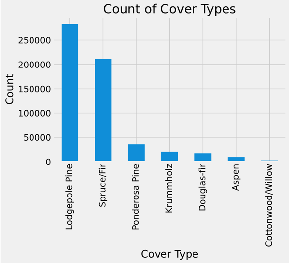

# Introduction
The year of 2020 has been a long and stressful one, there are many stressors from the pandemic to the election, as such I felt that it would be nice to have a return to nature for something to analyze. I decided on a data set focused on different types of forest cover in the Roosevelt National Forest in Colorado, or the "Forest Cover Type Dataset". The dataset was provided by the Jock A. Blackard of the University of Colorado on the UCI website, however, I first found the dataset via Kaggle where it had been previously used for a competition.  
The dataset is made up of observations for 30m by 30m sections of the forest. The dataset provides a number of cartographic features, such as the Soil Type and the Disctance to the nearest surface water, all of which I plan to use in predicting the Cover Type. Here is the make up of Cover Types for the sections of forests included in our dataset:

# Data Cleaning and Feature Engineering
The exploration of the dataset showed that it was already a very clean. There are no missing values or columns with open ended string data. The one problem I faced was that two features, Soil Type and Wilderness Area, were already One Hot Encoded which could lead to an impact to certain models. The first steps I took for feature engineering were to revert the one hot encoding for Soil Type and Wilderness Area. Having the Soil Type categories further allowed me to extract the Climatic Zone and Geological Zone, as both were part of the Soil Type codes. The last feature I engineered was taking the Horizontal and Vertical distances to the nearest surface water and find the straight line distance to the nearest water, thank you Pythagoras and your theorem for making this feature possible. 

# Choosing Metrics and Models
First I needed to determine what metric I would use for measuring the model. The default choice for a multi-class classification problem is typically Accuracy Score. I tried for a baseline accuracy score using the majority class technique which resulted in a baseline score of 49 percent, just below the 50 percent guideline for using Accuracy as a metric. I decided to stick with the default and use Accuracy, partially due to the closeness to the guideline as well as my own assumptions that accurately predicting the Cover Type is more useful in this case that Precision or Recall would be. Not to mention the Kaggle Competition where I first found the dataset was based on Accuracy. 
Once the metric was decided on it was time to move on to modeling the data. Since this is a classification problem a good linear model to start with was a Logistic Regression model. Funnily enough for this model I needed the One Hot Encoding on my categorical variables, so the first step was to use a One Hot Encoder, undoing the steps taken in my data cleaning. Since there were no other transformations needed it was on to the model. The Logistic Regression Model performed better than the baseline at 72 percent for both the training and validation sets. I would say that is an improvement, however, even after tuning the hyperparameters the score for my test dataset was still 72 percent.
The next type of model I wished to try was something tree-based. In this case I attempted modeling with three different tree-based classifiers: RandomForestClassifier, XGBoostClassifier, and CatBoostClassifier. After choosing the models it took some time run and tune each model's hyperparameters. The result of which was that the RandomForestClassifier model performed best in all cases. 
Since this forest dataset seemed to prefer the Random Forest model I chose to finalize the Random Forest Model. Initially it appeared that the Random Forest model was overfit with an accuracy score on the training data of 100 percent, that said further checking of the Validation set had an accuracy 95 percent. Considering that this might just be a model that has high accuracy I confirmed the Accuracy with the Test set, which scored 96 percent. These two scores led me to the conclusion that this model is excellent at determining the Cover Type of the Roosevelt National Forest. 

# Findings
Overall this was a fun experience in modeling and predicting data. As discussed my model of choice was the Random Forest Classifier, in this case the model provided by SciKit Learn. The model performed better than all other models I attempted, and even though it appeared to be overfit, the model had an excellent accuracy score. The model's most important feature turned out to be Elevation. 
This is shown in the Feature Importances:

Confirmed by the Permutation Importances:

And the Shapley Force Plot:

The major caveat of my model is that it will likely only be applicable to the Roosevelt National Forest. If I were to take any sets of cartographic features from a different location, I believe that the model would need some new training.
